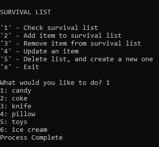
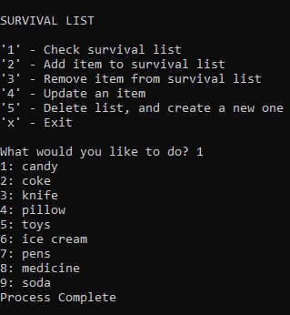
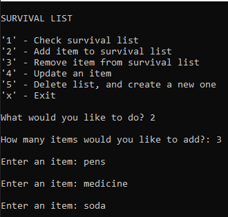

# File Manipulation

## Lab-03 System.IO

Author: Sue Tarazi, Harlen Lopez, Joseph Hangarter

### Description
* This is a C# console application that will ask a user to enter survival items to their list. Users also have the options to delete, update, and view their survival list.

### Getting Started
Clone this repository to your local machine.

* git clone https://github.com/JCode1986/Lab-03-File-Manipulation.git
To run the program from Visual Studio:
Select File -> Open -> Project/Solution

* Next navigate to the location you cloned the Repository.

* Double click on the Lab03-File-Manipulation directory.

* Then select and open Lab3-File-Manipulation.sln

### Visuals

